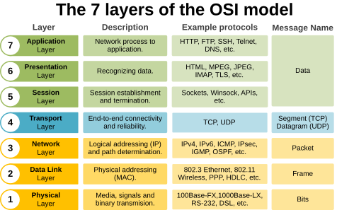

# OSI Model Deep Dive

This page explains why the OSI model still matters, how the seven layers interact, what each layer does in real telecom networks, and how to analyze traffic with `tcpdump` and Wireshark.

---

## 1. Why the 7 Layers Exist

The OSI model is a conceptual framework, not a protocol suite. It exists to:

- separate concerns across distinct functions,
- allow independent innovation per layer,
- enable interoperability between vendors,
- define clear service interfaces between peer layers.

The seven layers are:

1. Physical
2. Data Link
3. Network
4. Transport
5. Session
6. Presentation
7. Application

### Why not fewer layers?

- A model with fewer layers would mix too many concerns and hide critical design decisions.
- A model with more layers would become too granular and lose usefulness.
- The OSI split emphasizes the distinction between data transport, routing, and application-specific processing.

### Why not more than seven?

- The OSI model balances abstraction and practicality.
- Layers 5-7 group application-related functions that are often implemented together in modern stacks.
- The core networking and transport services are preserved separately from presentation and application logic.



---

## 2. How Layers Interact

Every layer provides services to the layer above and uses services from the layer below.

### Vertical relationships

- A layer sends data downwards, adding its header/trailer.
- The next lower layer treats that payload as opaque data.
- At the receiver, each layer removes its own header and passes the remaining payload up.

### Horizontal (peer) relationships

- Layer N on one host exchanges protocol data units (PDUs) with layer N on a peer host.
- The interaction is defined by the layer's protocol, e.g. IP at Layer 3 or TCP at Layer 4.

### Service, interface, and protocol

- Service: what a layer offers to the layer above.
- Interface: how the layer above accesses that service.
- Protocol: how end systems communicate at the same layer.

Example:

- Layer 3 service = packet forwarding.
- Layer 3 interface = `sendPacket()` / `route`.
- Layer 3 protocol = IPv4 / IPv6.

---

## 3. Layer-by-Layer Deep Dive

### Layer 1: Physical

- Defines electrical, optical, or radio signals.
- Examples: copper, fiber, wireless air interface, line encoding, bit timing, and modulation.
- Protocols / technologies: Ethernet PHY (802.3), SONET/SDH, OTN, DSL, LTE/5G air interface physical layer, fiber WDM.
- Common issues:
  - carrier or port down,
  - bad cable/connector or mismatched transceiver,
  - excessive bit errors, CRC failures, or alignment errors,
  - incorrect speed/duplex or clocking problems on ATM/SONET.
- Troubleshooting:
  - verify link light / physical port status,
  - check cable continuity and SFP/SFP+ module compatibility,
  - validate signal levels and modulation quality,
  - replace faulty patch cords or optics.
- `tcpdump`/Wireshark:
  - use interface statistics to verify packet counts and errors,
  - capture on the proper physical interface,
  - watch for CRC errors, alignment errors, or malformed frames at the interface.
- Common users/entities:
  - NICs, PHY chips, transceivers, cabling, physical ports,
  - telecom radios, base station antennas, optical transport equipment.
- By design, Layer 1 cannot detect or fix excessive bit errors. They impact the layers above.
  - commonly caused by Electro magnetic interference, faulty cabling, hardware failures
- CRC (Cyclic Redundancy Check) failures are detected in Layer 2. Indicates corruption of data during transmission

### Layer 2: Data Link

- Responsible for node-to-node frame delivery and physical addressing.
- Key functions: framing, MAC addressing, error detection, flow control, link aggregation, VLAN tagging.
- Protocols: Ethernet, ARP, STP/RSTP/MSTP, LLDP, 802.1Q VLAN, PPP, MPLS (as a link-layer technology in some deployments), LACP.
- Common issues:
  - VLAN mismatches and native VLAN leaks,
  - MAC flaps, duplicate MAC addresses, and port security violations,
  - STP loops or blocked ports causing intermittent outages,
  - ARP poisoning, stale ARP entries, or misconfigured LACP bundles.
- Troubleshooting:
  - verify MAC address tables and port state on switches,
  - check VLAN membership and trunk configuration,
  - look for broadcast storms, STP topology changes, or duplex mismatches,
  - ensure ARP table consistency and stable LACP bundles.
- `tcpdump`/Wireshark:
  - filter by Ethernet type: `eth.type == 0x0800` for IPv4, `eth.type == 0x8100` for 802.1Q,
  - inspect ARP: `arp`,
  - check LLDP: `lldp`,
  - decode VLAN tags and observe MAC source/destination pairs.
- Common users/entities:
  - switches, bridges, network interface cards, VLAN-aware devices,
  - telecom transport switches, Ethernet aggregation nodes, access switches.

### Layer 3: Network

- Packet forwarding and routing across multiple networks.
- Core functions: logical addressing, path selection, fragmentation, routing.
- Protocols: IPv4, IPv6, ICMP, OSPF, IS-IS, BGP, RIP, mobile IP, multicast routing (PIM).
- Common issues:
  - routing blackholes caused by missing routes,
  - asymmetrical paths and failed failover,
  - IP address conflicts and subnet overlaps,
  - MTU/fragmentation problems and ICMP unreachable responses.
- Troubleshooting:
  - verify IP address configuration and subnet masks,
  - check routing tables and next-hop reachability,
  - use ping/traceroute to validate path and latency,
  - inspect ACLs/route filters blocking traffic, and verify MTU settings.
- `tcpdump`/Wireshark:
  - filter by IP: `ip` or `ipv6`,
  - filter by protocol: `icmp`, `ospf`, `bgp`, `ip.proto == 6`,
  - inspect TTL/hop limit changes and ICMP unreachable messages,
  - identify fragmentation or misaddressed packets.
- Common users/entities:
  - routers, L3 switches, virtual routers, firewalls,
  - telecom core routers, mobile packet core nodes, NAT gateways, VPN concentrators.

### Layer 4: Transport

- End-to-end data transfer, reliability, flow control, and multiplexing.
- Protocols: TCP, UDP, SCTP, DCCP, QUIC (built on UDP), RTP (when treated as a transport payload), and transport-layer QoS markers.
- Common issues:
  - TCP retransmissions, packet loss, and window starvation,
  - connection resets, handshake failures, or slow start congestion,
  - UDP packet drops, out-of-order delivery, and jitter,
  - blocked or misrouted ports and transport-layer ACL drops.
- Troubleshooting:
  - check TCP connection states, retransmissions, duplicate ACKs, and window size,
  - verify UDP port reachability and packet loss,
  - confirm SCTP association establishment and heartbeat health,
  - analyze port numbers and session resets to pinpoint application transport issues.
- `tcpdump`/Wireshark:
  - filter by TCP/UDP ports: `tcp.port == 443`, `udp.port == 500`,
  - inspect TCP flags: `tcp.flags.syn == 1`, `tcp.analysis.retransmission`,
  - use `tcp.stream eq N` to follow a specific conversation,
  - examine sequence/ack numbers, retransmission events, and handshake timing.
- Common users/entities:
  - endpoints, load balancers, NAT devices, transport proxies,
  - telecom signaling gateways, PCRF/PCEF nodes, media gateways, session border controllers.

### Layer 5: Session

- Manages sessions and dialog control between two applications.
- Functions: session establishment, maintenance, teardown, authentication, checkpoints, and reconnection.
- Protocols: SIP, SQL over TCP, RPC frameworks, NetBIOS, PPTP, SMB session layer elements, TLS session resumption (as a session-related mechanism).
- Common issues:
  - session hangs or forgotten half-open sessions,
  - authentication failures and expired credentials,
  - session timeout or keepalive failure,
  - broken session negotiation due to protocol mismatches.
- Troubleshooting:
  - validate session setup and teardown messages,
  - check authentication/authorization failures,
  - confirm that session timers and keepalive traffic are operating,
  - identify mismatched session parameters or stateful middlebox interference.
- `tcpdump`/Wireshark:
  - filter by SIP: `sip`,
  - follow TCP streams for session negotiation,
  - inspect payloads for session identifiers, cookies, and handshake messages,
  - use application protocol decodes to examine session establishment.
- Common users/entities:
  - session managers, application servers, SIP proxies, gateway controllers,
  - telecom MSC/AMF for call/session control, session border controllers, IMS CSCF nodes.

### Layer 6: Presentation

- Transforms data representation, encryption, compression, and encoding.
- Functions: data formatting, serialisation, encryption/decryption, compression, character encoding.
- Protocols: TLS/SSL, SSH encryption layer, SSL VPNs, ASN.1 BER/DER, MIME, JSON/XML formatting, media codecs.
- Common issues:
  - expired or untrusted certificates,
  - unsupported cipher suites or protocol versions,
  - decryption failures caused by missing keys or middleboxes,
  - invalid payload encoding or corrupted compression streams.
- Troubleshooting:
  - verify certificate validity and cipher negotiation,
  - check for decryption failures or protocol version mismatches,
  - inspect compressed payloads and encoding errors,
  - ensure supported character encodings and serialization formats are consistent.
- `tcpdump`/Wireshark:
  - filter TLS: `tls`, `ssl`,
  - inspect handshake messages and cipher suites,
  - decode application data when keys are available,
  - examine certificate exchange and session reuse.
- Common users/entities:
  - TLS terminators, VPN gateways, encryption libraries, media codec engines,
  - telecom IMS application servers, SIP/SDP payload handlers, secure API gateways.

### Layer 7: Application

- Interfaces directly to end-user applications and services.
- Functions: user interaction, application protocols, data generation, service requests, and responses.
- Protocols: HTTP/HTTPS, DNS, FTP, SMTP, IMAP, POP3, SIP, REST/JSON APIs, gRPC, WebSocket, SNMP.
- Troubleshooting:
  - verify service availability and endpoint responses,
  - inspect application-layer status codes, error messages, and payload semantics,
  - check API authentication, request structure, and content negotiation,
  - correlate application logs with network traces.
- Common issues:
  - service outages, application crashes, and failed API calls,
  - misrouted or malformed requests,
  - authentication/authorization errors,
  - backend or service dependencies failing.
- `tcpdump`/Wireshark:
  - filter by protocol: `http`, `dns`, `sip`, `mqtt`,
  - inspect request/response headers, URIs, and payload content,
  - use `follow TCP stream` for HTTP/HTTPS payloads,
  - decode REST/XML/JSON messages to validate application behavior.
- Common users/entities:
  - web browsers, mobile apps, mail clients, API clients, management consoles,
  - telecom OSS/BSS systems, service orchestration platforms, network monitoring tools.

---

## 4. Telecom Equipment Perspective

In telecom, the OSI model maps to network domains and nodes differently than in enterprise LANs.

### RAN and transport nodes

- User Equipment (UE): handles layers 1-3 on the radio side.
- gNodeB / eNodeB: Layer 1/2 processing in the radio access network.
- Transport network: often carries Layer 2 (Ethernet/MPLS) and Layer 3 (IP) traffic.
- Routers and switches in the transport domain forward packets and frames between RAN and core.

### Core network

- Mobility Management Entity (MME), Serving Gateway (S-GW), Packet Gateway (P-GW), and 5GC control/user plane functions operate at higher layers.
- Core nodes often inspect Layer 4+ data for policy enforcement, QoS, and service chaining.
- VoLTE and IMS services are examples where application-layer SIP and RTP are critical.

### Node examples

- `gNB` in 5G: manages physical radio, MAC, RLC, PDCP, and RRC.
- `UPF` in 5G: routes IP packets, applies QoS, and interconnects to external data networks.
- `MME` / `AMF`: handles signaling and session management at Layer 5/7.

---

## 5. Packet Structure at Each Layer

### Layer 2 frame structure

- Ethernet header: destination MAC, source MAC, EtherType.
- Optional VLAN tag: 802.1Q tag.
- Payload: often an IP packet or MPLS label stack.
- Trailer: Frame Check Sequence (FCS).

### Layer 3 packet structure

- IPv4 header: version, IHL, DSCP, total length, identification, flags, TTL, protocol, src/dst addresses.
- IPv6 header: version, traffic class, flow label, payload length, next header, hop limit, src/dst addresses.
- Encapsulates a Layer 4 segment.

### Layer 4 segment structure

- TCP header: source port, dest port, sequence, acknowledgement, flags, window, checksum, options.
- UDP header: source port, dest port, length, checksum.
- SCTP header: verification tags, checksum, chunk types.

### Layer 5-7 data structure

- Application payload varies by protocol.
- Example: HTTP request line + headers + body.
- Example: DNS query/response format inside UDP.

---

## 6. Practical Traffic Analysis with `tcpdump` and Wireshark

A key skill for interviews and architecture work is reading real traffic.

### `tcpdump` examples

- Capture Ethernet traffic:

  ```bash
  sudo tcpdump -i eth0 -n -vv
  ```

- Capture only IP traffic:

  ```bash
  sudo tcpdump -i eth0 -n ip
  ```

- Capture TCP port 80 traffic:

  ```bash
  sudo tcpdump -i eth0 -n tcp port 80
  ```

- Capture UDP DNS traffic:

  ```bash
  sudo tcpdump -i eth0 -n udp port 53
  ```

### Wireshark analysis

- Open a packet capture and inspect layer-by-layer fields.
- Useful filters:
  - `eth.src == 00:11:22:33:44:55`
  - `ip.src == 10.0.0.1`
  - `tcp.port == 443`
  - `udp.port == 53`
  - `http`
  - `tls`

### What to look for in captures

- Layer 2: MAC addresses, VLAN tags, Ethernet type.
- Layer 3: IP address, TTL/hop limit, protocol field.
- Layer 4: TCP flags, window size, sequence numbers, UDP ports.
- Layer 7: application protocol fields like DNS query names or HTTP request URIs.

### Real-world troubleshooting workflow

1. Identify the physical/logical interface carrying the traffic.
2. Confirm link and VLAN state at Layer 1/2.
3. Verify IP reachability and routing at Layer 3.
4. Inspect transport connections for retransmissions or packet loss.
5. Decode application messages for errors or service failures.

---

## 7. Interview Prep: TCP vs UDP Trade-offs

### TCP

- Connection-oriented and reliable.
- Provides retransmission, ordering, congestion control, flow control.
- Best for applications that require correctness: HTTP, SSH, file transfer, APIs.
- Overhead is higher because of the handshake and acknowledgements.

### UDP

- Connectionless and lightweight.
- No retransmission, no ordering guarantee.
- Best for real-time, low-latency applications: VoIP, video, DNS, telemetry.
- Application must handle packet loss, duplication, or reordering if needed.

### Trade-offs

- Use TCP when data integrity and order matter.
- Use UDP when latency is more important than perfect delivery.
- Some telecom protocols use UDP with application-layer reliability.
- Use TCP for web and control-plane traffic; use UDP for media and fast signaling.

### Common interview answer structure

- State the difference: reliability vs speed.
- Explain reliability mechanisms in TCP.
- Explain stateless simplicity in UDP.
- Give telecom examples:
  - TCP for HTTP/HTTPS and API control messages.
  - UDP for DNS, RTP/VoIP, and packet-based media.
- Mention where SCTP might be used (telecom signaling, SCTP for Diameter/SIP in carrier networks).

---

## 8. Key Concepts to Remember

- OSI is conceptual; real stacks combine layers but the model still helps reason about problems.
- Layer 1/2 issues are physical and link-related; layers 3/4 are routing and transport-related; layers 5-7 are session, presentation, and application.
- In telecom, the radio and core domains map OSI functions differently than enterprise LANs.
- Packet capture skills are essential: identify the layer, isolate the protocol, and interpret headers.
- Interviewers expect clarity around TCP vs UDP and a practical example of when to use each.

---

## Sources

- ISO/IEC 7498-1:1994, Information technology — Open Systems Interconnection — Basic Reference Model: The Basic Model
- RFC 791, Internet Protocol
- RFC 793, Transmission Control Protocol
- RFC 768, User Datagram Protocol
- Cisco: "The OSI Model and Network Protocols"
- Wireshark Foundation: Packet analysis and capture techniques
- 3GPP TS 23.003: Numbering, addressing and identification
- Practical experience from telecom network design and troubleshooting
